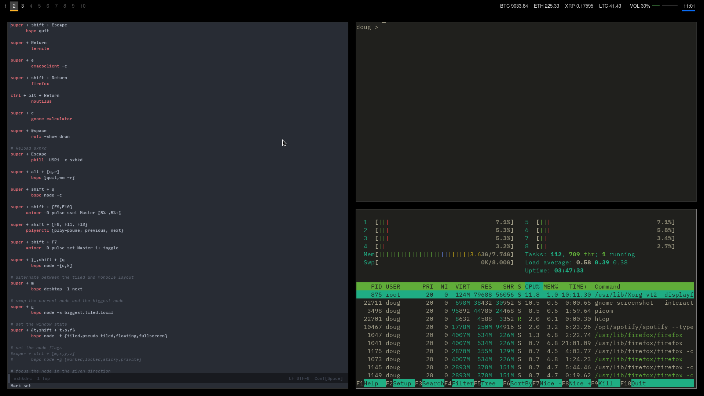

My Simple BSPWM Configuration
---

My simple BSPWM configuration.

**Features:**

- Cryptocurrency priecs in top panel
- Better window rules using my custom external-rules.py script

**Dependencies:**

- bspwm - Tiling window manager
- sxhkd - Hotkey daemon
- polybar - The Panel

**Optional Dependencies:**

- termite - Terminal (binded to super+return)
- rofi - Program launcher (binded to super+space)
- picom (Formerly compton. A compositor.)
- hsetroot (flat color background)
